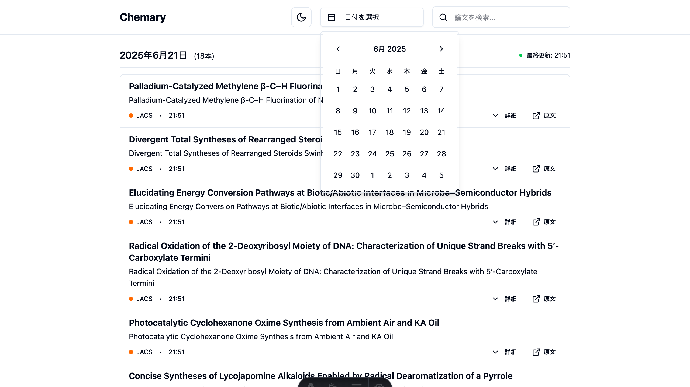

# 論文閲覧機能

Chemmaryのメイン機能である論文閲覧について詳しく説明します。

## 基本的な表示

### 日別論文リスト
- 最新の論文を**日付ごと**に整理して表示
- 各論文は**タイトル、著者、ジャーナル名、アブストラクト**を含む
- 見やすいカード形式でレイアウト

### 日付選択機能
ヘッダーのカレンダーボタンから過去の論文を日付別に閲覧可能：

#### 機能概要
- **カレンダーピッカー**: 日付を選択して過去の論文を表示
- **日本語ローカライゼーション**: 日本語表記のカレンダー
- **ダークモード対応**: テーマに合わせた見た目の調整
- **レスポンシブ対応**: モバイル・デスクトップ両対応

#### 使用方法
1. ヘッダーの「日付を選択」ボタンをクリック
2. カレンダーから希望の日付をクリック
3. **専用の日付ページ**（`/date/2024-12-17`）に移動
4. その日の論文一覧を表示
5. 「今日に戻る」リンクで最新の論文に戻る

#### ページネーション機能
日付ページでは前日・次日への移動が簡単：

- **前日ボタン**: 前の日の論文を表示
- **次日ボタン**: 次の日の論文を表示
- **範囲制限**: 30日間のデータ保持期間内のみ移動可能
- **キーボード対応**: 矢印キーでの移動（予定）



*カレンダーピッカーの操作画面*

#### ダークモード対応
すべての機能でダークモードがサポートされています：


*ダークモードでのカレンダー表示*

#### 対応期間とURL構造
- **過去30日間**: RSS取得済みの論文を表示
- **データ保持**: 30日を超えた古い論文は自動削除
- **表示件数**: 1日あたり最大50件の論文を表示
- **URL形式**: `/date/YYYY-MM-DD`（例：`/date/2024-12-17`）
- **ブックマーク対応**: 各日付ページは独立してアクセス可能
- **SEO対応**: 検索エンジンでの日付別論文ページの発見が容易

#### 無効な日付の処理
- **範囲外日付**: 30日より古い日付はカレンダーで選択不可
- **データなし日付**: 論文が存在しない日付でも専用ページを表示
- **エラーハンドリング**: 無効な日付形式は自動的にトップページにリダイレクト

### コンパクトリストデザイン
情報密度を重視した横長リスト形式で論文を表示：

#### デザイン原則
- **情報密度最優先**: 1画面で5-6本の論文を同時閲覧可能
- **スキャナビリティ**: 素早い情報取得を重視
- **コンパクト性**: 無駄なスペースを削除し効率的な画面利用
- **最適な幅制御**: 最大幅を制限し大画面での余白を最小化

#### リストアイテム構成
```
┌─────────────────────────────────────────────────────────────┐
│ ● 工業プロセスにおける持続可能な触媒作用                      │
│   Sustainable Catalysis in Industrial Chemical Processes   │
│   Angewandte Chemie • 8:00   [詳細] [原文]                │
└─────────────────────────────────────────────────────────────┘
```

#### 情報階層（上から下へ）
1. **日本語タイトル**: 太字、大きめフォント（主要情報）
2. **英語原文タイトル**: 小さめフォント、グレー（補助情報）
3. **メタ情報**: ジャーナル名、更新時刻、アクションボタン（一行）

#### 参考デザインソース
- **Hacker News日本語まとめ**: 番号リスト、コンパクト表示
- **情報密度**: 縦空間の効率的活用
- **リピーター最適化**: 余計な装飾を削除し実用性重視

## 詳細表示機能

### アブストラクト展開
- **タイトルクリック**でアブストラクト全文を表示
- **ワンクリック**で簡単に詳細確認
- 読み終わったら**再クリック**で折りたたみ

### 原文へのアクセス
- **「原文を読む」リンク**で元の論文ページへ直接移動
- 各論文誌の公式サイトで全文確認可能

### 化学式表示対応
Chemmaryでは化学式を正確に表示できます：

#### サポートされるHTML要素
- **下付き文字**: CO<sub>2</sub>, H<sub>2</sub>O, SO<sub>2</sub>など
- **上付き文字**: Fe<sup>3+</sup>, H<sup>+</sup>など（今後対応予定）
- **特殊文字**: 化学記号、ギリシャ文字など

#### 表示例
```
通常テキスト: CO2 → 化学式表示: CO₂
通常テキスト: H2O → 化学式表示: H₂O  
通常テキスト: SO2 → 化学式表示: SO₂
```

### ナビゲーション機能
#### ホームリンク
- **ヘッダーのChemmaryロゴ**をクリックでホームページに戻る
- どのページからでもワンクリックで最新論文一覧へ
- 標準的なWebサイトナビゲーション方式を採用

## 検索機能

### リアルタイム検索
ヘッダーの検索ボックスで論文をリアルタイム検索できます：

#### 検索対象フィールド
- **日本語タイトル**: AI翻訳されたタイトル
- **英語タイトル**: 原文タイトル
- **著者名**: 研究者名での絞り込み
- **ジャーナル名**: 論文誌名での絞り込み
- **アブストラクト**: 論文概要での全文検索

#### 検索機能の特徴
```typescript
interface SearchFeatures {
  realtime: true;           // リアルタイム検索
  caseInsensitive: true;    // 大文字小文字を区別しない
  partialMatch: true;       // 部分一致検索
  multiLanguage: true;      // 日本語・英語対応
  chemicalFormula: true;    // 化学式対応
}
```

#### 使用方法
1. **ヘッダーの検索ボックス**に検索キーワードを入力
2. **リアルタイム表示**: 入力と同時に結果をフィルタリング
3. **検索結果表示**: マッチした論文数と検索語句を表示
4. **日付グループ維持**: 検索結果も日付ごとにグループ化
5. **クリア機能**: 検索ボックスを空にすると全論文表示に戻る

#### 検索例
```
基本検索:
- "触媒" → 触媒関連論文を表示
- "catalyst" → 英語での触媒検索
- "CO2" → 二酸化炭素関連論文

化学式検索:
- "H2O" → 水関連論文
- "SO2" → 二酸化硫黄関連論文
- "Fe3+" → 鉄イオン関連論文

ジャーナル検索:
- "Nature" → Nature Chemistry論文のみ
- "JACS" → JACS論文のみ
- "Angewandte" → Angewandte Chemie論文のみ

著者検索:
- "Smith" → Smith氏の論文
- "田中" → 田中氏の論文
```

#### モバイル対応
- **レスポンシブデザイン**: モバイルでも快適な検索体験
- **モバイルメニュー**: ハンバーガーメニュー内に検索ボックス
- **タッチ最適化**: タップしやすいインターフェース

#### パフォーマンス
- **高速検索**: クライアントサイド検索で即座に結果表示
- **メモ化最適化**: React useMemoによる再計算抑制
- **軽量実装**: 外部ライブラリ不要のシンプル実装

## データ更新

### 自動更新スケジュール
- **朝の更新**: 午前8時（通勤前チェック）
- **夕方の更新**: 午後5時（帰宅前チェック）
- **GitHub Actions**: 定期実行によるRSSフィード取得
- **静的サイト再生成**: 新着論文データでページ更新

### RSS取得システム
各論文誌の公式RSSフィードから自動取得：

#### データフロー
1. **RSS取得**: 各ジャーナルの公式フィードを定期取得
2. **データ変換**: 統一フォーマットへの正規化
3. **翻訳処理**: タイトルの日本語翻訳（AI翻訳）
4. **サイト更新**: 新しいデータでAstro.jsサイトを再生成

### 対応論文誌とRSSフィード

**Nature Chemistry**
- **RSS URL**: `https://feeds.nature.com/nchem/rss/current`
- **更新頻度**: 週2-3回
- **特徴**: 材料科学、触媒、有機化学など幅広い分野
- **取得データ**: タイトル、著者、アブストラクト、DOI

**Journal of the American Chemical Society (JACS)**
- **RSS URL**: `https://pubs.acs.org/action/showFeed?type=etoc&feed=rss&jc=jacsat`
- **更新頻度**: 週5-6回
- **特徴**: 化学全般の最高峰ジャーナル
- **取得データ**: タイトル、著者、アブストラクト、DOI

**Angewandte Chemie International Edition**
- **RSS URL**: `https://onlinelibrary.wiley.com/action/showFeed?jc=15213773&type=etoc&feed=rss`
- **更新頻度**: 週3-4回
- **特徴**: ドイツ化学会の国際誌
- **取得データ**: タイトル、著者、アブストラクト、DOI

### データ処理仕様

#### 取得フィールド
```typescript
interface PaperData {
  title: string;           // 英語原題
  titleJa?: string;        // 日本語翻訳（AI生成）
  authors: string[];       // 著者リスト
  journal: string;         // ジャーナル名
  abstract: string;        // アブストラクト
  doi: string;            // DOI識別子
  publishedDate: Date;     // 公開日
  rssDate: Date;          // RSS取得日時
  originalLink: string;    // 原文リンク
}
```

#### フィルタリング条件
- **日付範囲**: 過去30日間のみ保持
- **重複除去**: DOIベースでの重複記事排除
- **品質管理**: アブストラクトが存在する記事のみ

## 表示の工夫

### レイアウト最適化
- **最大幅制限**: 大画面では不要な余白を削減
- **レスポンシブ設計**: 画面サイズに応じた最適な表示
- **コンテンツ密度**: 読みやすさを保ちつつ情報量を最大化

### 読みやすさの配慮
- **大きなフォントサイズ**で移動中でも読みやすい
- **十分な行間**でストレスなく閲覧
- **明確な区切り**で論文同士を判別しやすく

### 画面サイズ別最適化
- **モバイル**: フルスクリーン活用、縦方向の効率化
- **タブレット**: 中程度の幅制限、読みやすい行長
- **デスクトップ**: 最大幅制限で集中的な閲覧体験

### 情報の階層化
1. **第1階層**: タイトル・ジャーナル名（一覧性重視）
2. **第2階層**: 著者・要約の冒頭（概要把握）
3. **第3階層**: 全文アブストラクト（詳細確認）

必要に応じて段階的に情報を取得できます。

## 今後の改善予定

### 表示機能の拡張
- **分野別フィルタリング**: 有機化学、無機化学など
- **重要度表示**: インパクトファクターによる表示順調整
- **関連論文表示**: 類似研究の自動検出

### パフォーマンス向上
- **画像の最適化**: より高速な表示
- **キャッシュ機能**: 繰り返し閲覧の高速化
- **オフライン対応**: 一度見た論文はオフラインでも閲覧可能